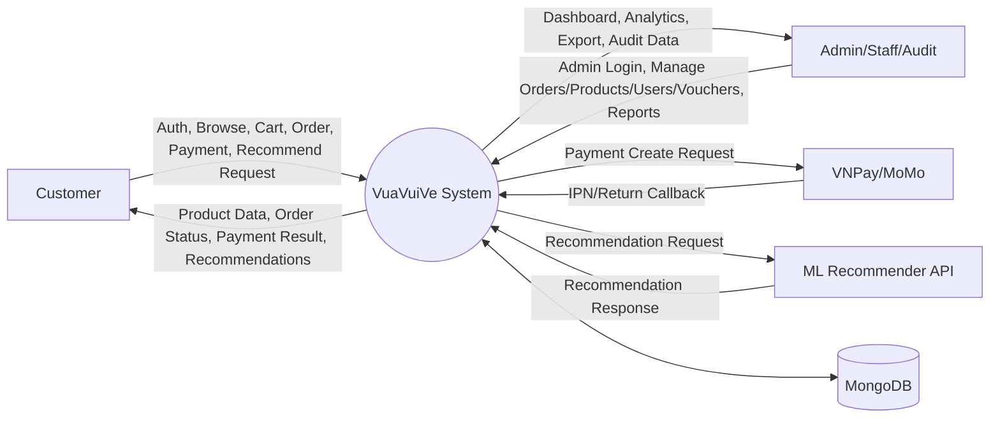
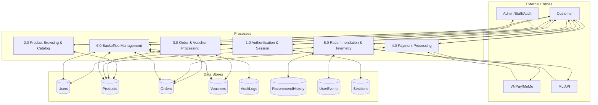
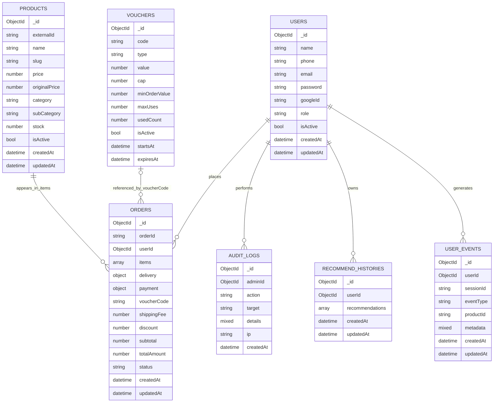

## 3.1. System Requirements

The VuaVuiVe platform is designed as a mini-grocery e-commerce system with two front-end portals (Customer and Admin), a Node.js/Express backend API, MongoDB as the primary data store, integrated online payment gateways (VNPay/MoMo), and a recommendation module.

### 3.1.1. Functional Requirements

The following functional requirements are derived from the implemented business flows and existing project endpoints.

| ID | Functional Area | Requirement Description |
|---|---|---|
| FR-01 | Account authentication | The system shall allow customer account registration using email/phone and password. |
| FR-02 | Customer login lifecycle | The system shall support login, logout, profile retrieval, profile update, and password change for customers. |
| FR-03 | Backoffice authentication | The system shall allow admin/staff/audit roles to log in through the admin portal. |
| FR-04 | Google sign-in | The system shall support Google OAuth login for eligible users. |
| FR-05 | Password recovery | The system shall provide a forgot-password flow via a dedicated endpoint. |
| FR-06 | Product catalog viewing | Customers shall be able to browse categories, product lists, and product details. |
| FR-07 | Product management | Admin/Staff users shall be able to create, update, and delete products, including image upload support. |
| FR-08 | Order placement | Authenticated customers shall be able to create orders with items, delivery data, and payment method. |
| FR-09 | Voucher validation | The system shall validate voucher codes at checkout before order confirmation. |
| FR-10 | Voucher application | The system shall calculate discount rules (cap/minimum conditions) and mark voucher usage after successful order creation. |
| FR-11 | Inventory control | The system shall validate inventory before order creation and decrement stock after successful checkout. |
| FR-12 | Customer order tracking | Customers shall be able to list their orders, view order details, and cancel orders in allowed states. |
| FR-13 | Order status update | Admin/Staff users shall update order status along allowed transitions (pending -> confirmed -> shipping -> delivered/cancelled). |
| FR-14 | Payment status update | The system shall update payment status from gateway callbacks or authorized internal endpoints. |
| FR-15 | VNPay transaction creation | The backend shall generate VNPay payment URLs with signature generation and callback verification (return/IPN). |
| FR-16 | MoMo transaction creation | The backend shall generate MoMo payment requests and verify IPN signatures before updating order payment status. |
| FR-17 | Product recommendation | The system shall provide recommendation endpoints and store recommendation history for authenticated users. |
| FR-18 | Recommendation fallback | If the ML service is unavailable, the backend shall return fallback recommendations from MongoDB product data. |
| FR-19 | User behavior tracking | The system shall store behavioral events (view_product/add_to_cart/purchase/view_recipe) for telemetry and recommendation improvement. |
| FR-20 | Recipe flow | Customers shall be able to browse recipe lists and view recipe details. |
| FR-21 | Dashboard and analytics | Backoffice users shall access operational dashboard and analytics features. |
| FR-22 | Voucher administration | Backoffice users shall list, create, update, and delete vouchers. |
| FR-23 | User administration | Admin/Audit users shall view user lists/details; Admin users shall update/delete users. |
| FR-24 | Audit logs | The system shall store and query administrative audit logs. |
| FR-25 | CSV export | Backoffice users shall export orders, products, and users to CSV files. |
| FR-26 | Real-time notifications | The system shall provide SSE-based push events for order-status updates. |

### 3.1.2. Non-functional Requirements

| ID | Non-functional Area | Requirement Description |
|---|---|---|
| NFR-01 | Modular architecture | The system should separate frontend, backend, payment demo, and ML service for maintainability and scalability. |
| NFR-02 | Authentication security | The system should use HttpOnly session cookies, split customer/admin cookies, and MongoDB-backed sessions (connect-mongo). |
| NFR-03 | Application security | The backend should enforce Helmet, CORS allow-list, and CSRF protection. |
| NFR-04 | Password protection | Passwords should be hashed (bcrypt) before persistence and never returned as plaintext. |
| NFR-05 | Access control | The system should enforce RBAC with role/permission checks (e.g., orders.write, products.write). |
| NFR-06 | Rate limiting | Sensitive APIs should apply rate limiting to reduce brute-force and abuse risk. |
| NFR-07 | Data integrity | The system should validate input, stock levels, totals, vouchers, and legal order-status transitions. |
| NFR-08 | Payment reliability | The backend should verify VNPay/MoMo callback signatures before payment-state mutation. |
| NFR-09 | Recommendation availability | The recommendation flow should include local fallback when the ML service times out or fails. |
| NFR-10 | Query performance | Frequently queried fields should be indexed (e.g., user events by user/session/product). |
| NFR-11 | Observability | The system should provide request logging, health checks, audit trails, and telemetry events. |
| NFR-12 | Dev environment compatibility | The platform should run in local development with fixed ports (3000, 4200, 4201, 5001, 8888). |
| NFR-13 | Usability | The solution should separate customer and admin portals to improve role clarity and usability. |
| NFR-14 | Maintainability | The codebase should follow route-controller-model-middleware modular organization. |

## 3.2. Actors and Use Cases

The system involves multiple actor groups, with authorization enforced through session-based authentication and role/permission checks.

### 3.2.1. Actor Description

| Actor | Description | Primary Goal | Typical Permissions/Capabilities |
|---|---|---|---|
| Guest | Unauthenticated visitor | Explore products and public content | View homepage, catalog, product details, recipes, and informational pages; cannot place orders |
| Customer | Authenticated end user | Purchase products and track orders | Register/login, manage profile, place orders, apply vouchers, pay via VNPay/MoMo, view/cancel orders, receive recommendations |
| Admin | Highest-privilege backoffice role | Operate and govern the platform | Manage users, products, orders, vouchers, audit logs, dashboard/analytics, and exports |
| Staff | Operational backoffice role | Execute day-to-day operations | Manage products, update order status, view dashboard/reports based on permissions |
| Audit | Compliance/monitoring role | Supervise and inspect operations | View dashboard/reports, access audit logs, and review users based on audit permissions |
| VNPay Gateway | External payment system | Process VNPay transactions | Receive payment requests and send return/IPN callbacks |
| MoMo Gateway | External payment system | Process MoMo transactions | Receive payment requests and send IPN callbacks |
| Recommender Service (ML API) | External Flask service | Generate personalized recommendations | Accept recommendation requests and return ranked products |
| MongoDB | Central data store | Persist business and session data | Store users, products, orders, vouchers, events, recommendation history, and sessions |

Main use-case summary by actor:

| Actor | Main Use Cases |
|---|---|
| Guest | Browse product pages, view recipes, search/read content, access login/register pages |
| Customer | Login/logout, update profile, checkout, validate vouchers, online payment, order tracking/cancelation, recommendation usage, event generation |
| Admin | Admin login, user/voucher/product management, order management/export, dashboard and audit review |
| Staff | Admin login, order status operations, product operations, dashboard/report access by permission |
| Audit | Admin login, dashboard/reports, audit-log review, user review by permission |
| VNPay/MoMo | Receive payment requests and return callbacks for payment-state synchronization |
| ML API | Serve recommendation requests; backend falls back locally when unavailable |

Remarks:
- Internal actors (Admin, Staff, Audit) are separated by role-permission rules to prevent privilege conflicts.
- External actors (VNPay, MoMo, ML API) are integrated through well-defined APIs, while the backend remains the orchestration layer.

### 3.2.2. Updated Use Case Diagram (Backend-Integrated)

Your suggested structure is largely correct. The updated diagram below keeps the same three-cluster layout, but aligns actor permissions and backend flows with the implemented system.

```mermaid
usecaseDiagram
actor "Anonymous Visitor" as Guest
actor Customer
actor Admin
actor Staff
actor Audit
actor "External Payment Gateway" as PayGW
actor "External ML Service" as MLSvc

rectangle "VuaVuiVe Backend System" {
	rectangle "Customer-side" {
		(View Public Products)
		(View Public Recipes)
		(Register Account)
		(Login)
		(Manage Profile)
		(Browse and Search Products)
		(View Product Details)
		(Manage Cart)
		(Apply Voucher)
		(Checkout)
		(Place Order)
		(Make Payment)
		(Track Orders)
		(Cancel Order)
		(Get Product Recommendations)
	}

	rectangle "Back-office" {
		(Manage Products)
		(Manage Orders)
		(Manage Vouchers)
		(Manage Users)
		(View Users)
		(View Dashboard and Reports)
		(View Audit Logs)
	}

	rectangle "External Integration" {
		(Process Online Payment)
		(Return Payment Callback)
		(Update Payment Status)
		(Generate Recommendations)
	}
}

Guest --> (View Public Products)
Guest --> (View Public Recipes)
Guest --> (Register Account)
Guest --> (Login)
Guest --> (Browse and Search Products)
Guest --> (View Product Details)

Customer --> (Login)
Customer --> (Manage Profile)
Customer --> (Browse and Search Products)
Customer --> (View Product Details)
Customer --> (Manage Cart)
Customer --> (Apply Voucher)
Customer --> (Checkout)
Customer --> (Place Order)
Customer --> (Make Payment)
Customer --> (Track Orders)
Customer --> (Cancel Order)
Customer --> (Get Product Recommendations)

Admin --> (Manage Products)
Admin --> (Manage Orders)
Admin --> (Manage Vouchers)
Admin --> (Manage Users)
Admin --> (View Users)
Admin --> (View Dashboard and Reports)
Admin --> (View Audit Logs)

Staff --> (Manage Products)
Staff --> (Manage Orders)
Staff --> (Manage Vouchers)
Staff --> (View Dashboard and Reports)

Audit --> (View Dashboard and Reports)
Audit --> (View Audit Logs)
Audit --> (View Users)

PayGW --> (Process Online Payment)
PayGW --> (Return Payment Callback)
MLSvc --> (Generate Recommendations)

(Checkout) ..> (Apply Voucher) : <<include>>
(Checkout) ..> (Place Order) : <<include>>

(Make Payment) ..> (Checkout) : <<extend>>
(Apply Voucher) ..> (Checkout) : <<extend>>

(Make Payment) ..> (Process Online Payment) : <<include>>
(Return Payment Callback) ..> (Update Payment Status) : <<include>>

(Get Product Recommendations) ..> (Generate Recommendations) : <<include>>
```

Notes:
- The diagram is intentionally simplified for readability (presentation-friendly) while preserving current backend behavior.
- Payment callback and recommendation generation are modeled as external integration use cases invoked by backend flows.
- Staff and Audit permissions are separated to match role-based behavior in the current implementation.

## 3.4. Data Flow Diagram (DFD)

Backend-to-MongoDB connectivity has been validated successfully in the development environment:
- MONGO_URI: mongodb://localhost:27017/vuavuive
- Connection status: MONGODB_CONNECTION_OK

### 3.4.1. DFD Context (Level 0)



### 3.4.2. DFD Level 1



### 3.4.3. DFD Process Description

| Process | Input | Main processing | Output | Data stores |
|---|---|---|---|---|
| 1.0 Authentication & Session | Login/Register/Profile requests | Validate credentials, hash password, create/load session | Auth response, user profile, session cookie | Users, Sessions |
| 2.0 Product Browsing & Catalog | Product/category queries | Filter/search/paginate products | Product list/detail/category response | Products |
| 3.0 Order & Voucher Processing | Checkout data, voucher code | Validate stock, validate voucher, create order, decrease stock | Order created / error | Products, Orders, Vouchers |
| 4.0 Payment Processing | Payment create request, gateway callback | Create signed request, verify callback signature, mark paid | Payment URL/result, updated order status | Orders |
| 5.0 Recommendation & Telemetry | Recommend request, behavior events | Proxy to ML, fallback local, persist history/events | Recommendation list, telemetry acknowledgement | Products, RecommendHistory, UserEvents |
| 6.0 Backoffice Management | Admin operations | RBAC check, CRUD/admin analytics/export, audit trail | Admin data and reports | Users, Products, Orders, Vouchers, AuditLogs |

## 3.5. Database Design

Database su dung MongoDB (database: vuavuive) voi Mongoose schema lam lop mo ta du lieu va rang buoc.

### 3.5.1. Entity-Relationship Diagram (ERD)



Design notes:
- Voucher-to-Order is a soft reference via the voucherCode field (no hard foreign key).
- The sessions collection is generated and managed by connect-mongo for express-session.

### 3.5.2. Database Schema

| Collection | Description | Key Fields | Index/Constraint |
|---|---|---|---|
| users | Stores customer and backoffice account information | name, phone, email, password, role, provider, isActive | unique(phone), unique(email), unique(googleId), sparse indexes |
| products | Stores product master and catalog information | name, slug, price, category, subCategory, stock, tags, isActive | unique(slug), index(externalId), enum(category) |
| orders | Stores order and payment state | orderId, userId, items[], delivery{}, payment{}, subtotal, totalAmount, status | unique(orderId), ref(userId -> users), ref(items.productId -> products) |
| vouchers | Stores voucher rules and usage counters | code, type, value, cap, minOrderValue, maxUses, usedCount, expiresAt | unique(code), uppercase(code), enum(type) |
| auditlogs | Stores backoffice action trails | adminId, action, target, details, ip | ref(adminId -> users) |
| recommendhistories | Stores recommendation history per user | userId, recommendations[] | ref(userId -> users) |
| userevents | Stores behavior events for recommendation and telemetry | userId, sessionId, eventType, productId, metadata | index(userId, createdAt), index(productId), index(sessionId, createdAt), enum(eventType) |
| sessions | Stores login sessions (connect-mongo) | _id, expires, session | TTL controlled by session store config |

### 3.5.4. Browser-Ready Mermaid Snippets (Copy/Paste)

Use these snippets directly in browser tools such as mermaid.live.

#### DFD - Context (Level 0)


#### DFD - Level 1


#### ERD


### 3.5.3. Data Dictionary

#### A. users

| Field | Type | Required | Description |
|---|---|---|---|
| _id | ObjectId | Yes | Primary identifier |
| name | String | Yes | Full name |
| phone | String | No | Vietnamese phone format, unique sparse |
| email | String | No | Email address, unique sparse |
| password | String | No | Hashed password, hidden by select:false |
| googleId | String | No | Google account id |
| avatar | String | No | Avatar URL/path |
| provider | String | Yes | local or google |
| address | String | No | User default address |
| role | String | Yes | user/admin/staff/audit |
| isActive | Boolean | Yes | Account active status |
| resetPasswordToken | String | No | Password reset token |
| resetPasswordExpires | Date | No | Token expiration |
| createdAt | Date | Yes | Created timestamp |
| updatedAt | Date | Yes | Updated timestamp |

#### B. products

| Field | Type | Required | Description |
|---|---|---|---|
| _id | ObjectId | Yes | Primary identifier |
| name | String | Yes | Product name |
| slug | String | Yes | SEO slug, unique |
| price | Number | Yes | Selling price |
| originalPrice | Number | No | Original/reference price |
| category | String | Yes | Product category enum |
| subCategory | String | No | Sub-category |
| description | String | No | Product description |
| imageUrl | String | No | Product image path/url |
| stock | Number | Yes | Current stock quantity |
| unit | String | No | Unit of measure |
| tags | [String] | No | Search/filter tags |
| isActive | Boolean | Yes | Active selling status |
| externalId | String | No | Legacy source id |
| createdAt | Date | Yes | Created timestamp |
| updatedAt | Date | Yes | Updated timestamp |

#### C. orders

| Field | Type | Required | Description |
|---|---|---|---|
| _id | ObjectId | Yes | Primary identifier |
| orderId | String | Yes | Business order code (ORD-XXXX) |
| userId | ObjectId | Yes | Owner reference to users |
| items | Array | Yes | Order item list |
| items[].productId | ObjectId | Yes | Reference to products |
| items[].productName | String | Yes | Product name snapshot |
| items[].quantity | Number | Yes | Ordered quantity |
| items[].price | Number | Yes | Item price snapshot |
| items[].subtotal | Number | Yes | Line subtotal |
| delivery | Object | Yes | Delivery receiver info |
| delivery.name | String | Yes | Receiver name |
| delivery.phone | String | Yes | Receiver phone |
| delivery.address | String | Yes | Receiver address |
| delivery.slot | String | No | Delivery slot |
| payment | Object | Yes | Payment state object |
| payment.method | String | Yes | cod/vnpay/momo |
| payment.status | String | Yes | pending/paid |
| payment.gateway | String | No | Gateway name |
| payment.transactionId | String | No | Gateway transaction id |
| payment.transactionTime | Date | No | Payment timestamp |
| payment.amount | Number | No | Paid amount |
| payment.gatewayResponse | Mixed | No | Raw callback data |
| voucherCode | String | No | Applied voucher code |
| shippingFee | Number | Yes | Shipping fee |
| discount | Number | Yes | Discount value |
| subtotal | Number | Yes | Order subtotal |
| totalAmount | Number | Yes | Final payable amount |
| status | String | Yes | pending/confirmed/shipping/delivered/cancelled |
| note | String | No | Customer note |
| createdAt | Date | Yes | Created timestamp |
| updatedAt | Date | Yes | Updated timestamp |

#### D. vouchers

| Field | Type | Required | Description |
|---|---|---|---|
| _id | ObjectId | Yes | Primary identifier |
| code | String | Yes | Voucher code, unique uppercase |
| type | String | Yes | ship/percent/fixed |
| value | Number | Yes | Discount value |
| cap | Number | No | Maximum discount cap |
| minOrderValue | Number | No | Minimum order amount |
| maxUses | Number | No | Maximum uses |
| usedCount | Number | No | Current used count |
| startsAt | Date | No | Start time |
| expiresAt | Date | No | Expire time |
| isActive | Boolean | Yes | Active status |
| note | String | No | Internal note |
| createdAt | Date | Yes | Created timestamp |
| updatedAt | Date | Yes | Updated timestamp |

#### E. auditlogs

| Field | Type | Required | Description |
|---|---|---|---|
| _id | ObjectId | Yes | Primary identifier |
| adminId | ObjectId | Yes | Admin actor reference |
| action | String | Yes | Action code |
| target | String | Yes | Target resource |
| details | Mixed | No | Extended details |
| ip | String | No | Source IP |
| createdAt | Date | Yes | Created timestamp |
| updatedAt | Date | Yes | Updated timestamp |

#### F. recommendhistories

| Field | Type | Required | Description |
|---|---|---|---|
| _id | ObjectId | Yes | Primary identifier |
| userId | ObjectId | Yes | User reference |
| recommendations | Array | No | Recommended item list |
| recommendations[].productId | String | Yes | Product id from recommendation output |
| recommendations[].score | Number | No | Recommendation score |
| recommendations[].reason | String | No | Explainability hint |
| createdAt | Date | Yes | Created timestamp |
| updatedAt | Date | Yes | Updated timestamp |

#### G. userevents

| Field | Type | Required | Description |
|---|---|---|---|
| _id | ObjectId | Yes | Primary identifier |
| userId | ObjectId | No | User reference (nullable for guest) |
| sessionId | String | Yes | Session tracking id |
| eventType | String | Yes | view_product/add_to_cart/purchase/view_recipe |
| productId | String | No | Related product id |
| metadata | Mixed | No | Additional event attributes |
| createdAt | Date | Yes | Created timestamp |
| updatedAt | Date | Yes | Updated timestamp |

#### H. sessions (connect-mongo)

| Field | Type | Required | Description |
|---|---|---|---|
| _id | String | Yes | Session id |
| expires | Date | Yes | Session expiration |
| session | String/Object | Yes | Serialized session payload |

