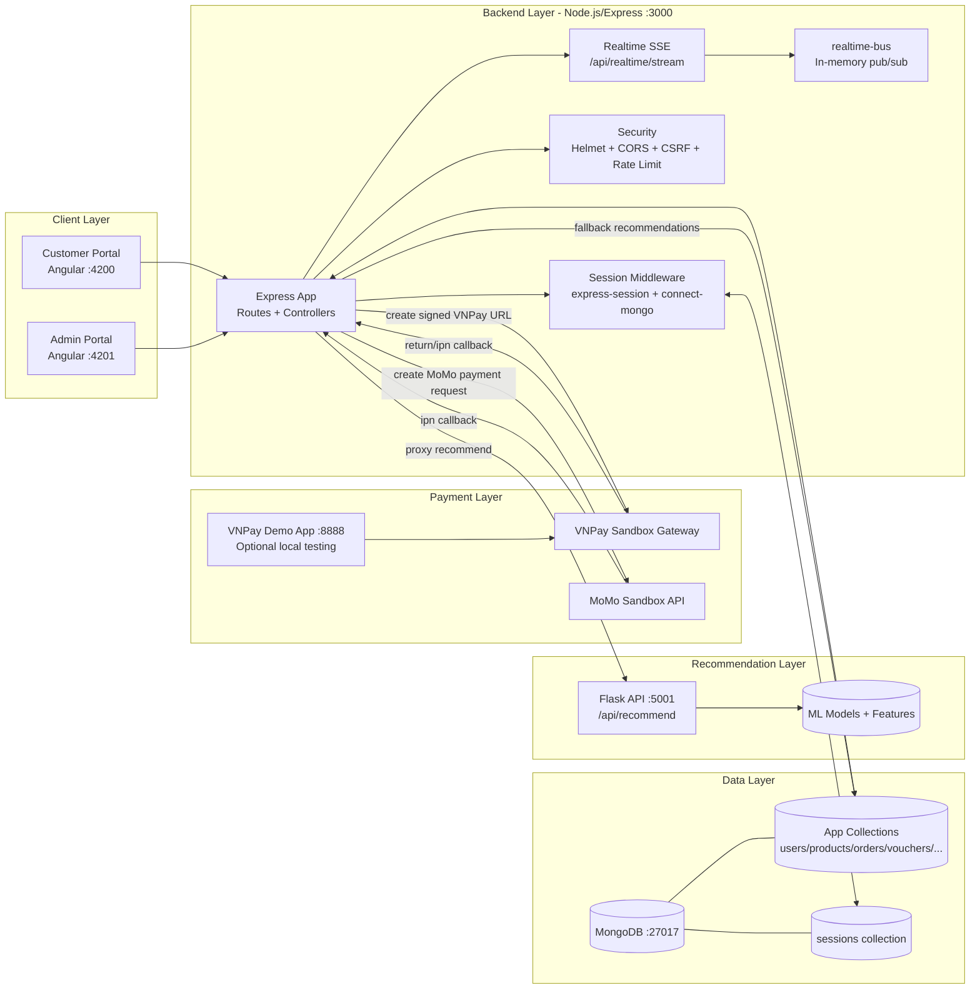
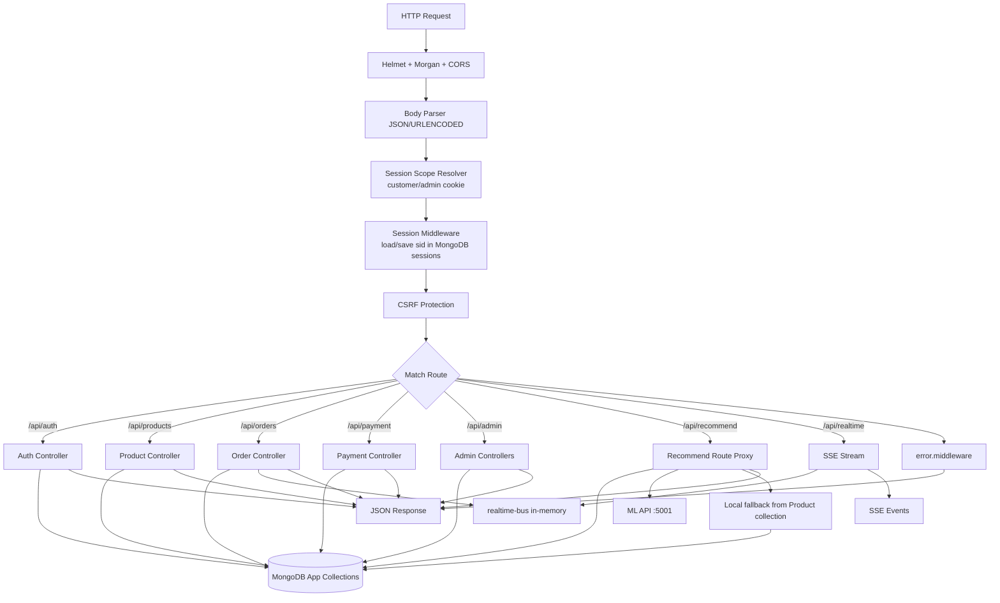
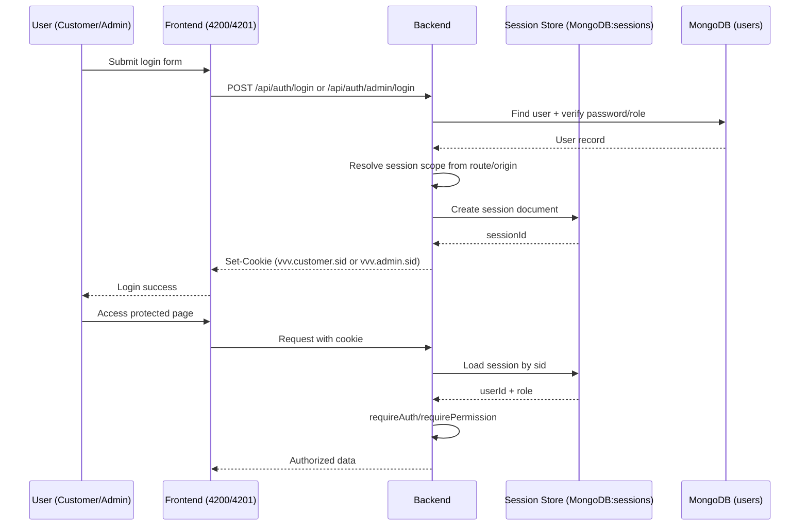
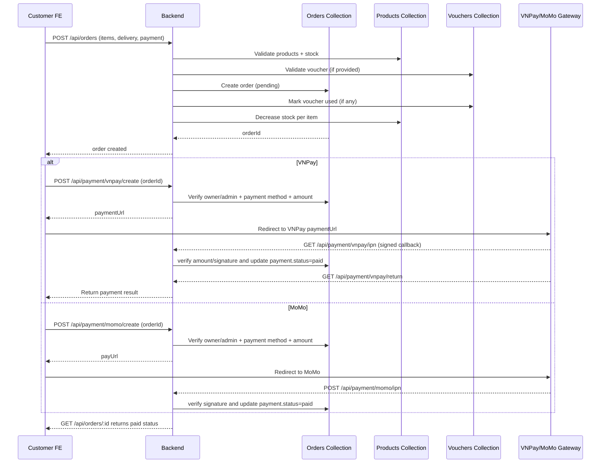
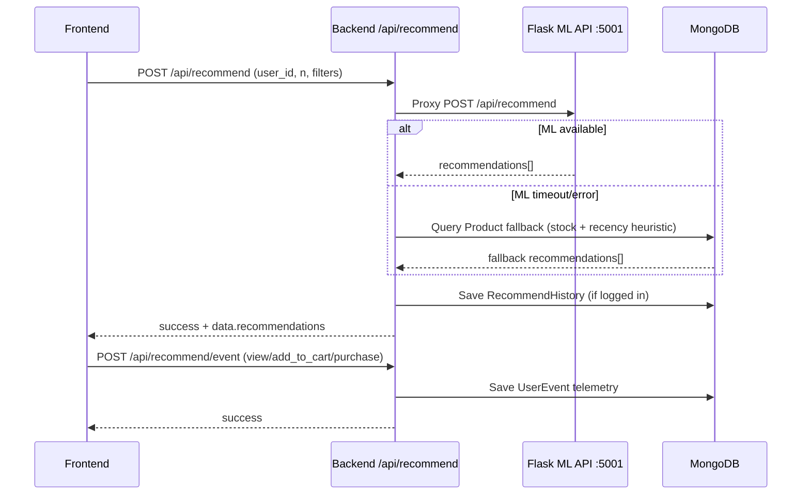
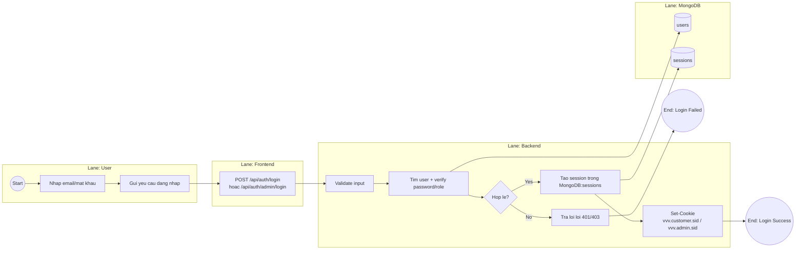
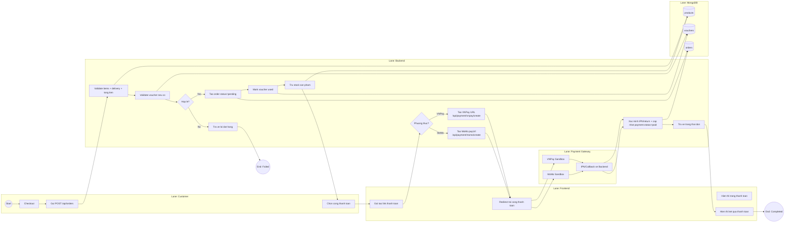

# VuaVuiVe - System Diagrams (Mermaid)

## 1) Overall System Architecture



## 2) Backend Request Flow (Express)



## 3) MongoDB ERD (Core Collections)

```mermaid
erDiagram
  USERS ||--o{ ORDERS : places
  USERS ||--o{ SESSIONS : authenticates
  USERS ||--o{ AUDIT_LOGS : performs
  USERS ||--o{ RECOMMEND_HISTORIES : receives
  USERS ||--o{ USER_EVENTS : generates
  PRODUCTS ||--o{ ORDERS : appears_in_items
  VOUCHERS o|--o{ ORDERS : applied_via_voucherCode

  USERS {
    ObjectId _id
    string name
    string email
    string phone
    string role
    string provider
    bool isActive
    datetime createdAt
  }

  PRODUCTS {
    ObjectId _id
    string externalId
    string name
    string slug
    number price
    string category
    string subCategory
    number stock
    bool isActive
    datetime createdAt
  }

  ORDERS {
    ObjectId _id
    string orderId
    ObjectId userId
    array items
    string status
    string payment.method
    string payment.status
    string payment.transactionId
    string voucherCode
    number subtotal
    number shippingFee
    number discount
    number totalAmount
    datetime createdAt
  }

  SESSIONS {
    string _id
    datetime expires
    string session_json
  }

  VOUCHERS {
    ObjectId _id
    string code
    string type
    number value
    number cap
    number minOrderValue
    number maxUses
    number usedCount
    bool isActive
    datetime expiresAt
  }

  AUDIT_LOGS {
    ObjectId _id
    ObjectId adminId
    string action
    string target
    mixed details
    string ip
    datetime createdAt
  }

  RECOMMEND_HISTORIES {
    ObjectId _id
    ObjectId userId
    array recommendations
    datetime createdAt
  }

  USER_EVENTS {
    ObjectId _id
    ObjectId userId
    string sessionId
    string eventType
    string productId
    mixed metadata
    datetime createdAt
  }
```

Ghi chu ERD:
- Quan he Voucher -> Order la quan he mem qua truong voucherCode (khong phai FK cung).
- Sessions la collection do connect-mongo quan ly de luu session dang nhap.

## 4) Auth + Session Flow (Customer/Admin)



## 5) Order + Payment (VNPay/MoMo) Flow



## 6) Recommendation Pipeline (Backend + ML + MongoDB)



## 7) Admin Backoffice Flow

```mermaid
flowchart LR
  A[Admin Portal :4201] --> B1[/api/admin/*]
  A --> B2[/api/products write routes]

  B1 --> M1[AuthN/AuthZ\nrequireBackofficeRole + requirePermission]
  B2 --> M2[AuthN/AuthZ\nrequireBackofficeRole admin/staff + products.write]

  M1 --> C1[Orders Management + Bulk Status]
  M1 --> C3[Vouchers Management]
  M1 --> C4[Export CSV (orders/products/users)]
  M2 --> C2[Create/Update/Delete Product]

  C1 --> DB[(MongoDB)]
  C2 --> DB
  C3 --> DB
  C4 --> DB

  C1 --> AL[Audit Logs (order update actions)]
  AL --> DB
```

## 8) BPMN-Style Process Diagrams

Luu y:
- Mermaid khong ho tro BPMN 2.0 native XML day du, nhung so do duoi day duoc ve theo phong cach BPMN (pool/lane, event, gateway, task) de dua vao report.

### 8.1 BPMN - Dang Nhap (Customer/Admin)



### 8.2 BPMN - Dat Hang va Thanh Toan



### 8.3 BPMN - Recommendation with Fallback

```mermaid
flowchart LR
  subgraph U[Lane: User/Frontend]
    S0((Start)) --> U1[Open Recommended Page]
    U1 --> U2[POST /api/recommend]
  end

  subgraph B[Lane: Backend]
    B1[Proxy request toi ML API]
    G1{ML response OK?}
    B2[Lay recommendations tu ML]
    B3[Lay fallback tu Product\n(stock + recency)]
    B4[Luu RecommendHistory neu da login]
    B5[Tra danh sach goi y]
  end

  subgraph M[Lane: ML Service]
    M1[Flask /api/recommend]
  end

  subgraph D[Lane: MongoDB]
    D1[(products)]
    D2[(recommendhistories)]
  end

  U2 --> B1 --> M1 --> G1
  G1 -- Yes --> B2 --> B4
  G1 -- No --> B3 --> D1 --> B4
  B4 --> D2
  B4 --> B5 --> E0((End))
```
