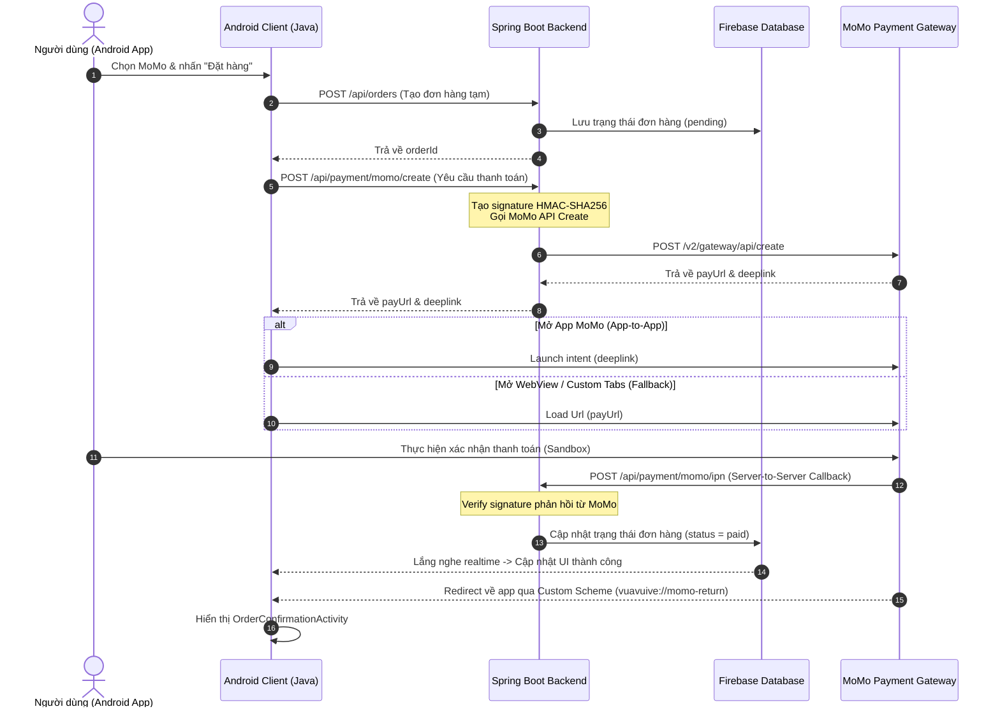

# Tài liệu Tích hợp Thanh toán MoMo cho Android (Java & XML) & Spring Boot Backend

Tài liệu này hướng dẫn chi tiết cách thiết lập, cấu hình và triển khai thanh toán MoMo Sandbox cho ứng dụng Android (sử dụng **Java** và **XML**) kết hợp với backend **Java Spring Boot** và cơ sở dữ liệu **Firebase**.

---

## 1. Luồng hoạt động (Payment Flow)

Sơ đồ dưới đây mô tả quá trình thanh toán từ lúc người dùng nhấn nút "Thanh toán bằng MoMo" cho đến khi giao dịch hoàn tất và cập nhật thời gian thực qua Firebase:



---

## 2. Thiết lập cấu hình MoMo Sandbox

Đầu tiên, bạn cần đăng ký tài khoản lập trình viên và lấy thông tin Sandbox từ trang [MoMo Developer](https://developers.momo.vn). Các thông tin thiết yếu bao gồm:

*   **Partner Code**: Mã đối tác doanh nghiệp.
*   **Access Key**: Khóa truy cập API.
*   **Secret Key**: Dùng để tạo chữ ký bảo mật HMAC-SHA256 (tuyệt đối không để lộ ở Client).
*   **Endpoint**: `https://test-payment.momo.vn/v2/gateway/api/create` (dành cho môi trường Sandbox).

---

## 3. Triển khai Spring Boot Backend (Java)

Backend chịu trách nhiệm bảo mật thông tin `Secret Key`, tạo mã chữ ký (`signature`), gửi yêu cầu tới MoMo, nhận phản hồi trạng thái từ MoMo và cập nhật trạng thái đơn hàng trực tiếp lên Firebase.

### 3.1. File cấu hình `application.yml`
```yaml
momo:
  partner-code: MOKODEMO20210702 # Thay bằng mã của bạn
  access-key: klm0568902890281    # Thay bằng key của bạn
  secret-key: dbgh12893891283912  # Thay bằng key của bạn
  endpoint: https://test-payment.momo.vn/v2/gateway/api/create
  redirect-url: vuavuive://momo-return
  ipn-url: https://your-domain.ngrok-free.app/api/payment/momo/ipn
```
> [!IMPORTANT]
> Địa chỉ `ipn-url` bắt buộc phải là URL public và hỗ trợ HTTPS. Khi chạy thử nghiệm ở localhost, bạn phải sử dụng công cụ như **ngrok** (`ngrok http 8080`) để tạo URL proxy public.

### 3.2. Cấu trúc Lớp Helper tạo Chữ ký (Signature Generator)
MoMo yêu cầu chữ ký số được mã hóa bằng thuật toán `HmacSHA256`. Thứ tự sắp xếp các thuộc tính trong chuỗi thô (raw signature) phải tuyệt đối chính xác theo quy định của tài liệu MoMo.

```java
package vn.vuavuive.backend.util;

import javax.crypto.Mac;
import javax.crypto.spec.SecretKeySpec;
import java.nio.charset.StandardCharsets;
import java.security.InvalidKeyException;
import java.security.NoSuchAlgorithmException;

public class MoMoSignature {

    public static String hmacSha256(String data, String key) {
        try {
            byte[] byteKey = key.getBytes(StandardCharsets.UTF_8);
            Mac sha256HMAC = Mac.getInstance("HmacSHA256");
            SecretKeySpec keySpec = new SecretKeySpec(byteKey, "HmacSHA256");
            sha256HMAC.init(keySpec);
            byte[] macData = sha256HMAC.doFinal(data.getBytes(StandardCharsets.UTF_8));
            
            // Convert to Hex
            StringBuilder result = new StringBuilder();
            for (byte b : macData) {
                result.append(String.format("%02x", b));
            }
            return result.toString();
        } catch (NoSuchAlgorithmException | InvalidKeyException e) {
            throw new RuntimeException("Lỗi tạo signature HMAC-SHA256", e);
        }
    }
}
```

### 3.3. DTO gửi yêu cầu lên MoMo (MoMoPaymentRequest)
```java
package vn.vuavuive.backend.dto;

import lombok.Builder;
import lombok.Data;

@Data
@Builder
public class MoMoPaymentRequest {
    private String partnerCode;
    private String partnerName;
    private String storeId;
    private String requestId;
    private String amount;
    private String orderId;
    private String orderInfo;
    private String redirectUrl;
    private String ipnUrl;
    private String lang;
    private String extraData;
    private String requestType;
    private String signature;
}
```

### 3.4. Triển khai PaymentController (Xử lý Request, Redirect và IPN)
Controller này sẽ gọi HTTP Client để gửi request tới MoMo, đồng thời lắng nghe IPN để cập nhật Firebase Realtime Database / Firestore.

```java
package vn.vuavuive.backend.controller;

import com.google.firebase.database.DatabaseReference;
import com.google.firebase.database.FirebaseDatabase;
import org.springframework.beans.factory.annotation.Value;
import org.springframework.http.*;
import org.springframework.web.bind.annotation.*;
import org.springframework.web.client.RestTemplate;
import vn.vuavuive.backend.dto.MoMoPaymentRequest;
import vn.vuavuive.backend.util.MoMoSignature;

import java.util.HashMap;
import java.util.Map;
import java.util.UUID;

@RestController
@RequestMapping("/api/payment/momo")
public class PaymentController {

    @Value("${momo.partner-code}")
    private String partnerCode;

    @Value("${momo.access-key}")
    private String accessKey;

    @Value("${momo.secret-key}")
    private String secretKey;

    @Value("${momo.endpoint}")
    private String endpoint;

    @Value("${momo.redirect-url}")
    private String redirectUrl;

    @Value("${momo.ipn-url}")
    private String ipnUrl;

    private final RestTemplate restTemplate = new RestTemplate();

    @PostMapping("/create")
    public ResponseEntity<?> createPayment(@RequestBody Map<String, Object> requestBody) {
        String orderId = (String) requestBody.get("orderId");
        String amount = String.valueOf(requestBody.get("amount"));
        String orderInfo = "Thanh toan don hang VuaVuiVe #" + orderId;
        String requestId = partnerCode + "_" + UUID.randomUUID().toString().replace("-", "").substring(0, 10);
        String extraData = "";
        String requestType = "captureWallet";

        // 1. Tạo chuỗi raw signature theo đúng thứ tự tài liệu MoMo quy định
        String rawSignature = "accessKey=" + accessKey +
                "&amount=" + amount +
                "&extraData=" + extraData +
                "&ipnUrl=" + ipnUrl +
                "&orderId=" + orderId +
                "&orderInfo=" + orderInfo +
                "&partnerCode=" + partnerCode +
                "&redirectUrl=" + redirectUrl +
                "&requestId=" + requestId +
                "&requestType=" + requestType;

        // 2. Ký chuỗi raw signature với Secret Key của bạn
        String signature = MoMoSignature.hmacSha256(rawSignature, secretKey);

        // 3. Xây dựng payload request gửi tới MoMo
        MoMoPaymentRequest moMoRequest = MoMoPaymentRequest.builder()
                .partnerCode(partnerCode)
                .partnerName("VuaVuiVe")
                .storeId("VuaVuiVeStore")
                .requestId(requestId)
                .amount(amount)
                .orderId(orderId)
                .orderInfo(orderInfo)
                .redirectUrl(redirectUrl)
                .ipnUrl(ipnUrl)
                .lang("vi")
                .extraData(extraData)
                .requestType(requestType)
                .signature(signature)
                .build();

        // 4. Gọi API MoMo
        HttpHeaders headers = new HttpHeaders();
        headers.setContentType(MediaType.APPLICATION_JSON);
        HttpEntity<MoMoPaymentRequest> entity = new HttpEntity<>(moMoRequest, headers);

        try {
            ResponseEntity<Map> response = restTemplate.postForEntity(endpoint, entity, Map.class);
            Map<String, Object> body = response.getBody();
            if (body != null && body.containsKey("payUrl")) {
                Map<String, Object> result = new HashMap<>();
                result.put("success", true);
                result.put("payUrl", body.get("payUrl"));
                result.put("deeplink", body.get("deeplink")); // Deep link mở app MoMo trực tiếp
                return ResponseEntity.ok(result);
            }
            return ResponseEntity.badRequest().body(Map.of("success", false, "message", "MoMo API error", "details", body));
        } catch (Exception e) {
            return ResponseEntity.status(500).body(Map.of("success", false, "message", "Không thể tạo liên kết thanh toán MoMo: " + e.getMessage()));
        }
    }

    /**
     * Endpoint IPN (Instant Payment Notification) lắng nghe phản hồi bất đồng bộ từ MoMo.
     * Cần cấu hình webhook/ipn nhận dạng chuẩn signature của MoMo gửi về để chống gian lận.
     */
    @PostMapping("/ipn")
    public ResponseEntity<?> receiveIpn(@RequestBody Map<String, Object> ipnPayload) {
        // Lấy các tham số để verify
        String amount = String.valueOf(ipnPayload.get("amount"));
        String extraData = (String) ipnPayload.get("extraData");
        String message = (String) ipnPayload.get("message");
        String orderId = (String) ipnPayload.get("orderId");
        String partnerCodePayload = (String) ipnPayload.get("partnerCode");
        String requestId = (String) ipnPayload.get("requestId");
        String responseTime = (String) ipnPayload.get("responseTime");
        String resultCode = String.valueOf(ipnPayload.get("resultCode"));
        String transId = String.valueOf(ipnPayload.get("transId"));
        String mSignature = (String) ipnPayload.get("signature");

        // 1. Tạo raw signature xác minh chiều ngược lại
        String rawVerifySig = "accessKey=" + accessKey +
                "&amount=" + amount +
                "&extraData=" + (extraData != null ? extraData : "") +
                "&message=" + message +
                "&orderId=" + orderId +
                "&partnerCode=" + partnerCodePayload +
                "&requestId=" + requestId +
                "&responseTime=" + responseTime +
                "&resultCode=" + resultCode +
                "&transId=" + transId;

        String calculatedSig = MoMoSignature.hmacSha256(rawVerifySig, secretKey);

        // 2. Xác thực signature
        if (!calculatedSig.equals(mSignature)) {
            return ResponseEntity.status(HttpStatus.BAD_REQUEST).body(Map.of("status", 97, "message", "Chữ ký không hợp lệ"));
        }

        // 3. Kiểm tra mã giao dịch thành công (resultCode == 0 là thành công)
        if ("0".equals(resultCode)) {
            updateOrderStatusInFirebase(orderId, "paid", transId);
        } else {
            updateOrderStatusInFirebase(orderId, "failed", transId);
        }

        // Trả lại trạng thái HTTP 204 hoặc JSON trống báo nhận IPN thành công
        return ResponseEntity.status(HttpStatus.NO_CONTENT).build();
    }

    /**
     * Cập nhật trạng thái thanh toán lên Firebase Realtime Database
     */
    private void updateOrderStatusInFirebase(String orderId, String status, String transactionId) {
        try {
            DatabaseReference ref = FirebaseDatabase.getInstance()
                    .getReference("orders")
                    .child(orderId);

            Map<String, Object> updates = new HashMap<>();
            updates.put("paymentStatus", status);
            updates.put("transactionId", transactionId);
            updates.put("updatedAt", System.currentTimeMillis());

            ref.updateChildrenAsync(updates);
        } catch (Exception e) {
            System.err.println("Lỗi cập nhật Firebase Database: " + e.getMessage());
        }
    }
}
```

---

## 4. Triển khai Android App (Java & XML)

Ở phía Client Android, chúng ta cần cấu hình để gọi API từ Spring Boot nhận `payUrl`/`deeplink`, chuyển hướng người dùng tới ứng dụng MoMo hoặc trình duyệt và đón sự kiện khi thanh toán xong.

### 4.1. Cấu hình Manifest và Deep Link (`AndroidManifest.xml`)

Bạn cần cấu hình để ứng dụng Android hỗ trợ mở lại thông qua Deep Link khi ví MoMo hoàn thành giao dịch, và đồng thời khai báo Package Visibility để Android 11+ có thể truy cập được ứng dụng MoMo cài trên máy.

```xml
<?xml version="1.0" encoding="utf-8"?>
<manifest xmlns:android="http://schemas.android.com/apk/res/android"
    package="vn.vuavuive.customer">

    <!-- Quyền truy cập Internet bắt buộc -->
    <uses-permission android:name="android.permission.INTERNET" />
    <uses-permission android:name="android.permission.ACCESS_NETWORK_STATE" />

    <!-- Khai báo Package Visibility để check ứng dụng MoMo trên máy (cho Android 11 trở lên) -->
    <queries>
        <package android:name="com.mservice.momotransfer" /> <!-- MoMo Production -->
        <package android:name="com.mservice.momotransfer.sandbox" /> <!-- MoMo Sandbox -->
    </queries>

    <application
        android:allowBackup="true"
        android:icon="@mipmap/ic_launcher"
        android:label="Vựa Vui Vẻ"
        android:theme="@style/Theme.VuaVuiVe">

        <!-- Checkout Activity chính của app -->
        <activity
            android:name=".ui.checkout.CheckoutActivity"
            android:exported="true">
            <intent-filter>
                <action android:name="android.intent.action.MAIN" />
                <category android:name="android.intent.category.LAUNCHER" />
            </intent-filter>
        </activity>

        <!-- Activity hứng phản hồi (Return) từ MoMo -->
        <activity
            android:name=".ui.checkout.PaymentReturnActivity"
            android:exported="true"
            android:launchMode="singleTask">
            <intent-filter android:label="Nhận kết quả MoMo">
                <action android:name="android.intent.action.VIEW" />
                <category android:name="android.intent.category.DEFAULT" />
                <category android:name="android.intent.category.BROWSABLE" />
                
                <!-- Định dạng deep link trùng với cấu hình redirectUrl của Backend (vuavuive://momo-return) -->
                <data
                    android:scheme="vuavuive"
                    android:host="momo-return" />
            </intent-filter>
        </activity>

    </application>
</manifest>
```

### 4.2. Layout XML cho Checkout (`activity_checkout.xml`)
```xml
<?xml version="1.0" encoding="utf-8"?>
<RelativeLayout xmlns:android="http://schemas.android.com/apk/res/android"
    android:layout_width="match_match"
    android:layout_height="match_parent"
    android:padding="16dp">

    <TextView
        android:id="@+id/tvOrderTitle"
        android:layout_width="wrap_content"
        android:layout_height="wrap_content"
        android:text="Chi tiết thanh toán đơn hàng"
        android:textSize="20sp"
        android:textStyle="bold"
        android:layout_centerHorizontal="true"
        android:layout_marginTop="20dp" />

    <LinearLayout
        android:layout_width="match_parent"
        android:layout_height="wrap_content"
        android:orientation="vertical"
        android:layout_below="@id/tvOrderTitle"
        android:layout_marginTop="30dp">

        <TextView
            android:id="@+id/tvOrderId"
            android:layout_width="wrap_content"
            android:layout_height="wrap_content"
            android:text="Mã đơn hàng: #ORD991283"
            android:textSize="16sp" />

        <TextView
            android:id="@+id/tvAmount"
            android:layout_width="wrap_content"
            android:layout_height="wrap_content"
            android:text="Số tiền: 50.000 VNĐ"
            android:textSize="18sp"
            android:textStyle="bold"
            android:textColor="#E91E63"
            android:layout_marginTop="10dp" />

        <!-- Nút thanh toán -->
        <Button
            android:id="@+id/btnPayWithMoMo"
            android:layout_width="match_parent"
            android:layout_height="55dp"
            android:text="Thanh toán qua ví MoMo"
            android:textColor="#FFFFFF"
            android:backgroundTint="#A50064"
            android:textSize="16sp"
            android:textStyle="bold"
            android:layout_marginTop="40dp" />

        <TextView
            android:id="@+id/tvStatus"
            android:layout_width="wrap_content"
            android:layout_height="wrap_content"
            android:text="Trạng thái đơn hàng: Chưa thanh toán"
            android:textSize="15sp"
            android:layout_marginTop="30dp"
            android:layout_gravity="center" />

    </LinearLayout>
</RelativeLayout>
```

### 4.3. Code Client gọi API tạo Payment (`CheckoutActivity.java`)
Client sẽ gửi mã đơn hàng và số tiền lên backend Spring Boot qua HTTP Client (ví dụ dùng `OkHttp` hoặc `Retrofit`), lấy về URL trả về rồi thực hiện điều hướng. Đồng thời, cấu hình listener để lắng nghe trạng thái thay đổi realtime từ Firebase Database.

```java
package vn.vuavuive.customer.ui.checkout;

import android.content.Intent;
import android.content.pm.PackageManager;
import android.net.Uri;
import android.os.Bundle;
import android.widget.Button;
import android.widget.TextView;
import android.widget.Toast;
import androidx.annotation.NonNull;
import androidx.appcompat.app.AppCompatActivity;

import com.google.firebase.database.DataSnapshot;
import com.google.firebase.database.DatabaseError;
import com.google.firebase.database.DatabaseReference;
import com.google.firebase.database.FirebaseDatabase;
import com.google.firebase.database.ValueEventListener;

import org.json.JSONObject;
import java.io.IOException;
import okhttp3.Call;
import okhttp3.Callback;
import okhttp3.MediaType;
import okhttp3.OkHttpClient;
import okhttp3.Request;
import okhttp3.RequestBody;
import okhttp3.Response;
import vn.vuavuive.customer.R;

public class CheckoutActivity extends AppCompatActivity {

    private String orderId = "ORD" + System.currentTimeMillis() / 1000;
    private long amount = 50000; // Số tiền thanh toán mẫu (50k)
    
    private TextView tvOrderId, tvAmount, tvStatus;
    private Button btnPayWithMoMo;
    private DatabaseReference mDatabase;
    private ValueEventListener paymentStatusListener;

    private static final String BACKEND_PAYMENT_URL = "http://10.0.2.2:8080/api/payment/momo/create";

    @Override
    protected void onCreate(Bundle savedInstanceState) {
        super.onCreate(savedInstanceState);
        setContentView(R.layout.activity_checkout);

        tvOrderId = findViewById(R.id.tvOrderId);
        tvAmount = findViewById(R.id.tvAmount);
        tvStatus = findViewById(R.id.tvStatus);
        btnPayWithMoMo = findViewById(R.id.btnPayWithMoMo);

        tvOrderId.setText("Mã đơn hàng: #" + orderId);
        tvAmount.setText("Số tiền: " + String.format("%,d", amount) + " VNĐ");

        // Khởi tạo tham chiếu Realtime Database để theo dõi đơn hàng
        mDatabase = FirebaseDatabase.getInstance().getReference("orders").child(orderId);

        btnPayWithMoMo.setOnClickListener(v -> requestMoMoPaymentUrl());

        // Lắng nghe realtime trạng thái thanh toán đơn hàng từ Firebase
        observePaymentStatus();
    }

    private void requestMoMoPaymentUrl() {
        OkHttpClient client = new OkHttpClient();
        
        JSONObject jsonPayload = new JSONObject();
        try {
            jsonPayload.put("orderId", orderId);
            jsonPayload.put("amount", amount);
        } catch (Exception e) {
            e.printStackTrace();
        }

        RequestBody body = RequestBody.create(
                jsonPayload.toString(),
                MediaType.parse("application/json; charset=utf-8")
        );

        Request request = new Request.Builder()
                .url(BACKEND_PAYMENT_URL)
                .post(body)
                .build();

        client.newCall(request).enqueue(new Callback() {
            @Override
            public void onFailure(@NonNull Call call, @NonNull IOException e) {
                runOnUiThread(() -> Toast.makeText(CheckoutActivity.this, "Không thể kết nối đến máy chủ", Toast.LENGTH_SHORT).show());
            }

            @Override
            public void onResponse(@NonNull Call call, @NonNull Response response) throws IOException {
                if (response.isSuccessful() && response.body() != null) {
                    try {
                        String responseData = response.body().string();
                        JSONObject jsonObject = new JSONObject(responseData);
                        if (jsonObject.getBoolean("success")) {
                            String payUrl = jsonObject.getString("payUrl");
                            String deeplink = jsonObject.optString("deeplink");

                            // Chuyển hướng người dùng thanh toán
                            handleMoMoRedirection(payUrl, deeplink);
                        } else {
                            showErrorToast(jsonObject.optString("message", "Lỗi bất định"));
                        }
                    } catch (Exception e) {
                        showErrorToast("Lỗi xử lý phản hồi máy chủ");
                    }
                } else {
                    showErrorToast("Lỗi kết nối từ máy chủ");
                }
            }
        });
    }

    private void handleMoMoRedirection(String payUrl, String deeplink) {
        // Ưu tiên mở App-to-App (Nếu MoMo Sandbox/Production được cài đặt trên thiết bị)
        if (deeplink != null && !deeplink.isEmpty() && isAppInstalled("com.mservice.momotransfer.sandbox")) {
            Intent intent = new Intent(Intent.ACTION_VIEW, Uri.parse(deeplink));
            startActivity(intent);
        } else {
            // Fallback mở trình duyệt/WebView với payUrl nếu không cài app
            Intent intent = new Intent(Intent.ACTION_VIEW, Uri.parse(payUrl));
            startActivity(intent);
        }
    }

    private boolean isAppInstalled(String packageName) {
        PackageManager pm = getPackageManager();
        try {
            pm.getPackageInfo(packageName, PackageManager.GET_ACTIVITIES);
            return true;
        } catch (PackageManager.NameNotFoundException e) {
            return false;
        }
    }

    private void observePaymentStatus() {
        paymentStatusListener = new ValueEventListener() {
            @Override
            public void onDataChange(@NonNull DataSnapshot snapshot) {
                if (snapshot.exists()) {
                    String status = snapshot.child("paymentStatus").getValue(String.class);
                    if ("paid".equalsIgnoreCase(status)) {
                        tvStatus.setText("Trạng thái đơn hàng: ĐÃ THANH TOÁN THÀNH CÔNG!");
                        tvStatus.setTextColor(getResources().getColor(android.R.color.holo_green_dark));
                        btnPayWithMoMo.setEnabled(false);
                    } else if ("failed".equalsIgnoreCase(status)) {
                        tvStatus.setText("Trạng thái đơn hàng: Thanh toán thất bại");
                        tvStatus.setTextColor(getResources().getColor(android.R.color.holo_red_dark));
                    }
                }
            }

            @Override
            public void onCancelled(@NonNull DatabaseError error) {
                // Xử lý lỗi kết nối Firebase
            }
        };
        mDatabase.addValueEventListener(paymentStatusListener);
    }

    private void showErrorToast(String message) {
        runOnUiThread(() -> Toast.makeText(CheckoutActivity.this, message, Toast.LENGTH_SHORT).show());
    }

    @Override
    protected void onDestroy() {
        super.onDestroy();
        if (mDatabase != null && paymentStatusListener != null) {
            mDatabase.removeEventListener(paymentStatusListener);
        }
    }
}
```

### 4.4. Đón kết quả chuyển hướng quay lại (`PaymentReturnActivity.java`)
Activity này chỉ có mục đích hứng Deep Link phản hồi từ ví MoMo để chuyển người dùng về màn hình xem hóa đơn hoặc thông báo tương ứng.

```java
package vn.vuavuive.customer.ui.checkout;

import android.content.Intent;
import android.net.Uri;
import android.os.Bundle;
import android.widget.TextView;
import androidx.appcompat.app.AppCompatActivity;
import vn.vuavuive.customer.R;

public class PaymentReturnActivity extends AppCompatActivity {

    private TextView tvReturnStatus;

    @Override
    protected void onCreate(Bundle savedInstanceState) {
        super.onCreate(savedInstanceState);
        
        // Giao diện hiển thị thông báo xử lý
        tvReturnStatus = new TextView(this);
        tvReturnStatus.setTextSize(18sp);
        tvReturnStatus.setPadding(30, 30, 30, 30);
        setContentView(tvReturnStatus);

        handleIntent(getIntent());
    }

    @Override
    protected void onNewIntent(Intent intent) {
        super.onNewIntent(intent);
        setIntent(intent);
        handleIntent(intent);
    }

    private void handleIntent(Intent intent) {
        Uri data = intent.getData();
        if (data != null && "vuavuive".equals(data.getScheme())) {
            // Lấy các tham số truy vấn MoMo gửi kèm khi redirect về ứng dụng
            String resultCode = data.getQueryParameter("resultCode");
            String message = data.getQueryParameter("message");
            String orderId = data.getQueryParameter("orderId");

            if ("0".equals(resultCode)) {
                tvReturnStatus.setText("Thanh toán thành công đơn hàng #" + orderId + "\nCảm ơn bạn đã mua hàng!");
            } else {
                tvReturnStatus.setText("Thanh toán thất bại.\nLý do: " + message);
            }
            
            // Ở đây bạn có thể mở Intent chuyển qua OrderConfirmationActivity hoặc tắt màn hình quay về Home
        }
    }
}
```

---

## 5. Danh sách tài khoản thử nghiệm ví MoMo Sandbox

Khi mở liên kết thanh toán MoMo Sandbox trên ứng dụng Android của bạn, hãy nhập thông tin sau đây để thanh toán giả định thành công:

| Mô tả | Thông tin thẻ | OTP / Password |
|---|---|---|
| **Ví MoMo Sandbox** | Số điện thoại bất kỳ (VD: `0901234567`) | `123456` |
| **Thẻ ATM NAPAS Sandbox** | Số thẻ: `9704000000000018`<br/>Tên: `NGUYEN VAN A`<br/>Ngày phát hành: `03/07` | `otp` |
| **Mã OTP mặc định** | Bất kỳ mã OTP nào khi MoMo hiển thị form xác nhận | `123456` hoặc `otp` |

---

## 6. Các lỗi thường gặp (Troubleshooting)

1.  **Lỗi Signature Mismatch (mã lỗi 97):**
    *   *Nguyên nhân:* Thứ tự các trường thô để sinh mã SHA-256 không đúng hoặc có tham số chứa giá trị rỗng/null mà không được xử lý chính xác.
    *   *Khắc phục:* Kiểm tra chính xác chuỗi `rawSignature` ở backend Spring Boot trùng khớp thứ tự các key trong tài liệu chính thức của MoMo.
2.  **IPN không gọi được về localhost:**
    *   *Nguyên nhân:* MoMo server không thể tìm thấy máy của bạn khi bạn sử dụng IP `localhost` hoặc `127.0.0.1`.
    *   *Khắc phục:* Chạy **ngrok** để chuyển tiếp cổng localhost của bạn thành URL public (Ví dụ: `ngrok http 8080`) rồi thay vào thuộc tính `ipn-url`.
3.  **Android App không mở lại sau khi thanh toán xong:**
    *   *Nguyên nhân:* Lỗi định cấu hình Scheme/Host trong `AndroidManifest.xml` hoặc sai `redirectUrl` gửi lên ở API.
    *   *Khắc phục:* Đối chiếu chính xác tham số `redirectUrl` (ví dụ: `vuavuive://momo-return`) ở server trả về với `<data android:scheme="vuavuive" android:host="momo-return" />` trong file manifest.
